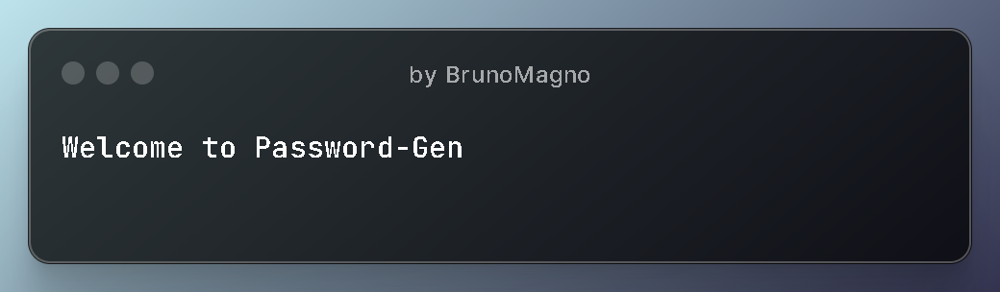

<h1 align="center"># Password-Gen</h1>



<h2 align="center">:computer:Generate strong, unique passwords with ease!</h2>

</br><h3><strong>This Python-based tool allows you to quickly create reliable passwords to protect your online accounts.</h3></strong>

 - <strong>:straight_ruler:Customizable password length:</strong> Choose the desired length of your password, ranging from 4 to 32 characters.
 - <strong>:lock:Secure password generation:</strong> Passwords are composed of a random mix of letters, numbers, and symbols, ensuring strength and unpredictability.
 - <strong>:package:Password storage:</strong> Conveniently view and access previously generated passwords within the application.
 - <strong>:zombie:User-friendly interface:</strong> Interact with an intuitive menu-driven interface, making it easy to navigate and use.
</br>
   
## :fire:Code 
<p><a href="PWGen.py">(Click here to view the code)</a></p>


</br>
</br>


## :open_file_folder:Installation:

```shell
git clone https://github.com/brunoliratm/Pw-Gen.git
cd Pw-Gen
python -u PWGen.py
```
</br>

## :rocket:Usage:

 1. Select `Generate password` to create a new password. </br>
 2. Specify the desired password length.</br>
 3. View and manage generated passwords in the `View passwords` section.
</br>

## :handshake:Contributing:

Pull requests are welcome. For major changes, please open an issue first
to discuss what you would like to change. </br>
</br>

<div align="center">
<i ><strong> ==Get started today and experience password security made simple!== </strong></i>
</div>
